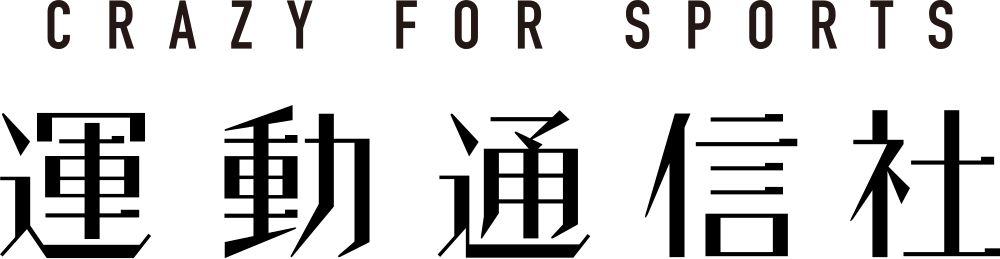

# CRAZY FOR SPORTS

<!--  -->

<picture>
  <!-- ダークモード用 -->
  <source
    srcset="../images/corporate_logo_white.svg"
    media="(prefers-color-scheme: dark)"
  />
  <!-- ライトモード用 -->
  <source srcset="../images/corporate_logo_black.svg" />
  
</picture>

## MISSION 01.
Maximize the appeal of sports,  
create a prosperous society  
and diverse culture.

スポーツの魅力を最大化し、豊かな社会、多様な文化を作る。

## MISSION 02.
Elevate the power of amateur,  
local and minor sports.

アマチュア・ローカル・マイナースポーツの持つ力を掘り起こす。

## MISSION 03.
Enhance and connect the value of the  
experience of "watching", "playing" and  
"supporting" sports.

スポーツの「みる」「する」「ささえる」の体験価値を高め、繋ぐ。
